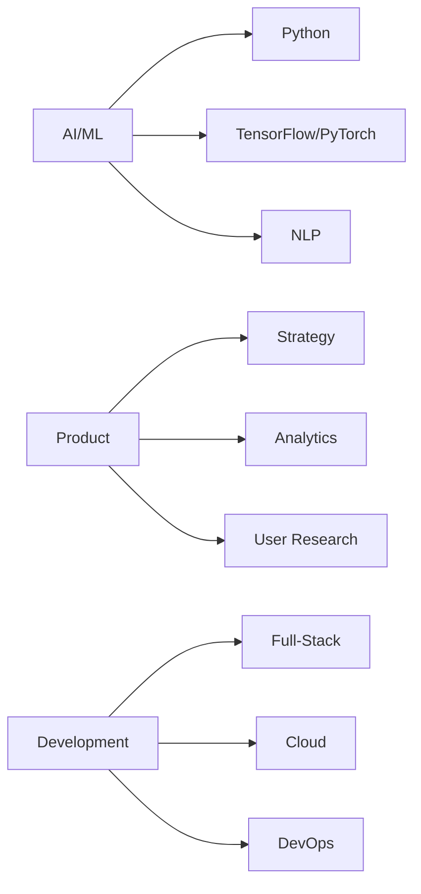

# Hi, I'm Willy V3 👋

[](https://willyv3.com)
[](https://linkedin.com/in/willyv3)
[](https://breakshit.blog)

## 🤖 AI Engineer by Night, Product Manager by Day

Based in Brooklyn, I bridge the worlds of AI engineering and product management. Currently shaping the future of HR tech at Justworks while building innovative AI solutions through V3Consult.

```python
class WillyV3:
    def __init__(self):
        self.location = "Brooklyn, NY"
        self.roles = ["AI Engineer", "Product Manager", "Consultant"]
        self.company = "Justworks"
        self.venture = "V3Consult"
        self.skills = {
            "ai": ["LLMs", "ML Engineering", "NLP"],
            "product": ["Strategy", "User Research", "Agile"],
            "tech": ["Python", "AI/ML Stack", "Full-Stack Development"]
        }
        self.dogs = ["Christopher", "Andrew"]
    
    def current_focus(self):
        return "Leveraging AI to create practical, human-centered solutions"
```

## 🌟 Featured Projects

### 🧠 V3 AI
AI consulting and application development, helping businesses leverage cutting-edge AI technology for practical solutions.
[Learn more →](https://v3-ai.com)

### 📚 SageDoc
An intelligent documentation platform that helps developers create, maintain, and navigate technical documentation with AI assistance.
[Experience better docs →](https://sagedoc.me)

### 🎨 Block UI
A modern React component library focused on creating beautiful, accessible, and responsive user interfaces.
[Explore components →](https://block-ui.com)

## 💡 Philosophy

```javascript
const myPhilosophy = {
  approach: "Building technology that serves humanity",
  focus: "Creating practical AI solutions for real-world problems",
  values: [
    "Human-centered design",
    "Ethical AI development",
    "Sustainable innovation"
  ]
};
```

## 🛠️ Tech Stack



## 🎯 Currently Working On

- Building next-gen AI applications at V3Consult
- Innovating HR tech solutions at Justworks
- Contributing to open-source AI projects
- Writing about AI and product development

## 🌆 After Hours

When I'm not coding or strategizing, you'll find me in Brooklyn with my two amazing dogs, Christopher and Andrew, exploring the city's vibrant tech scene, or working on innovative side projects that push the boundaries of AI applications.

---

<div align="center">

**Let's build something amazing together!**

[🌐 Website](https://v3-ai.com) • [💼 LinkedIn](https://linkedin.com/in/willyv3) • [📧 Email](mailto:willy@v3-ai.com)

</div>
